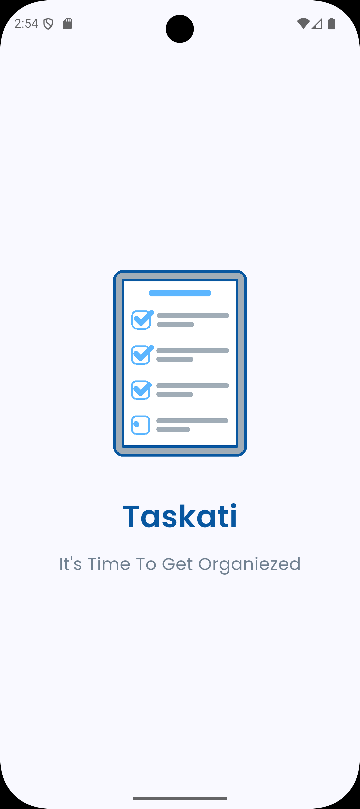
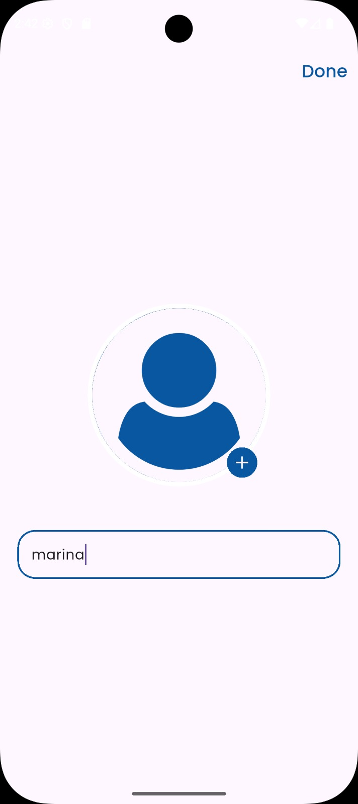
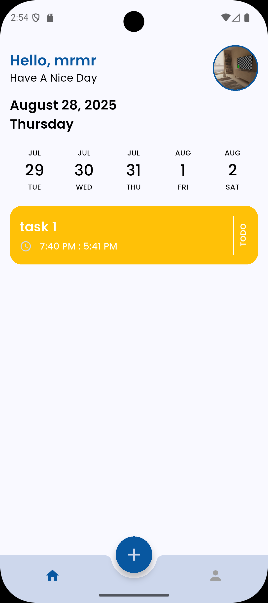
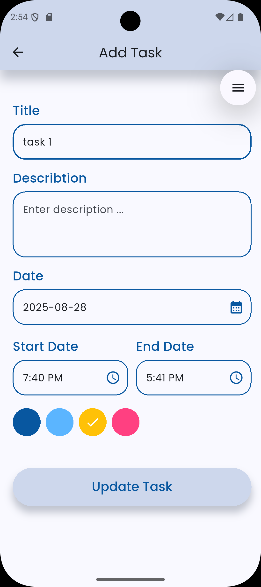
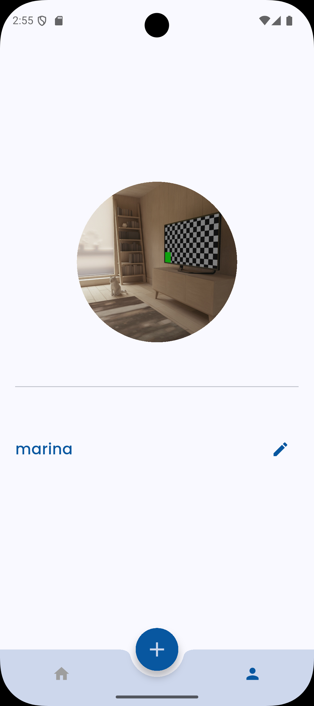

# 📝 Taskati App

**Taskati** is a modern Flutter task management application that helps users organize their daily tasks easily and efficiently.  
With a clean UI, profile customization, and interactive task controls, Taskati makes productivity simple and enjoyable.

---

## ✨ Features

- **Splash Screen** – Displays the app logo and name.
- **Upload Screen** – Users can upload their **name** and **profile picture** (name is required).
- **Home Screen**  
  - Date picker to select the day for tasks.  
  - Displays daily tasks.  
  - Swipe right → mark as **completed**.  
  - Swipe left → **delete** task.  
  - Floating action button in the center to add a new task.  
- **Add Task Screen** – Add a new task with:
  - Title  
  - Description  
  - Date & Time picker  
- **Profile Screen** – Update user **name** and **profile picture** (changes are reflected on the Home Screen).

---

## 📱 Screens

1. **Splash Screen**  
   - Shows logo and app name.  

2. **Upload Screen**  
   - Upload profile picture.  
   - Enter user name (mandatory).  
   - "Done" button to continue.  

3. **Home Screen**  
   - Select day using Date Picker.  
   - View daily tasks.  
   - Swipe → Complete or Delete tasks.  
   - Floating action button to add tasks.  

4. **Add Task Screen**  
   - Add task with title, description, date, and time.  

5. **Profile Screen**  
   - Update profile picture and name.  
   - Syncs changes with the Home Screen.  

---

## 📱 Screenshots

| Splash Screen | Upload Screen | Home Screen | Add Task Screen | Profile Screen |
|---------------|--------------|-------------|-----------------|----------------|
|  |  |  |  |  |

---

## 🛠 Tech Stack

- **Flutter** – Cross-platform framework.  
- **Dart** – Programming language.  

---

## 📂 Project Structure

lib/
├── core/
│ ├── utils/
│ ├── services/
├── features/
│ ├── splash/
│ ├── upload/
│ ├── home/
│ ├── add_task/
│ ├── profile/

